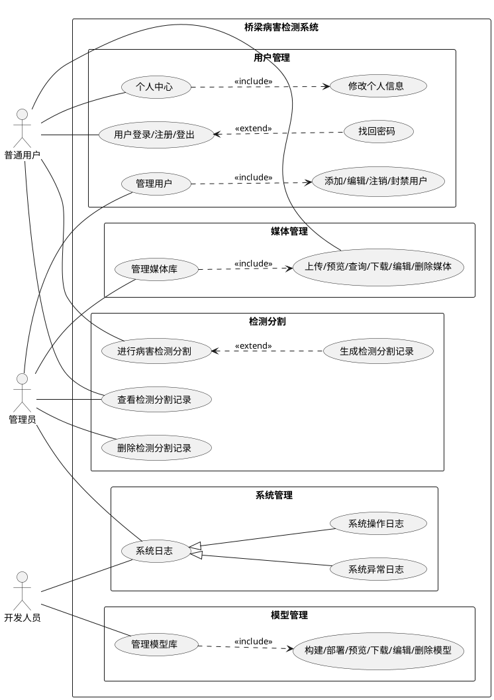

# 3.3.1 桥梁病害检测系统用例图

```plantuml
@startuml
left to right direction

actor "普通用户" as User
actor "管理员" as Admin
actor "开发人员" as Developer

rectangle "桥梁病害检测系统" {
  rectangle "用户管理" {
    usecase "用户登录/注册/登出" as UC1
    usecase "找回密码" as UC2
    usecase "个人中心" as UC3
    usecase "修改个人信息" as UC4
    usecase "管理用户" as UC5
    usecase "添加/编辑/注销/封禁用户" as UC6
  }

  rectangle "媒体管理" {
    usecase "上传/预览/查询/下载/编辑/删除媒体" as UC7
    usecase "管理媒体库" as UC8
  }

  rectangle "模型管理" {
    usecase "构建/部署/预览/下载/编辑/删除模型" as UC10
    usecase "管理模型库" as UC11
  }

  rectangle "检测分割" {
    usecase "进行病害检测分割" as UC12
    usecase "生成检测分割记录" as UC13
    usecase "查看检测分割记录" as UC14
    usecase "删除检测分割记录" as UC15
  }

  rectangle "系统管理" {
    usecase "系统日志" as UC16
    usecase "系统操作日志" as UC17
    usecase "系统异常日志" as UC18
  }

  ' 定义包含关系
  UC3 ..> UC4 : <<include>>
  UC5 ..> UC6 : <<include>>
  UC8 ..> UC7 : <<include>>
  UC11 ..> UC10 : <<include>>

  ' 定义扩展关系
  UC1 <.. UC2 : <<extend>>
  UC12 <.. UC13 : <<extend>>


  ' 定义泛化关系
  UC16 <|-- UC17
  UC16 <|-- UC18
}

' 定义关联关系
User -- UC1
User -- UC3
User -- UC7
User -- UC12
User -- UC14

Developer -- UC11
Developer -- UC16

Admin -- UC5
Admin -- UC8
Admin -- UC14
Admin -- UC15
Admin -- UC16
@enduml
```
