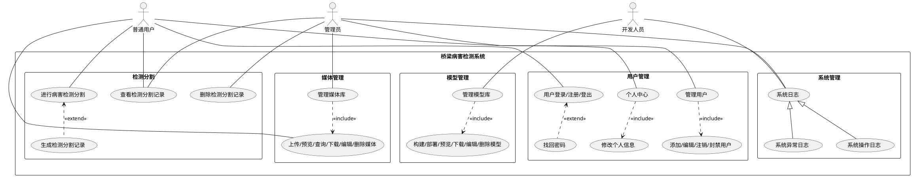

# 3.3.1 桥梁病害检测系统用例图

## 用例说明

### 角色描述

1. **管理员(Admin)**：系统最高权限用户，可以管理所有用户、查看操作日志、管理媒体库和执行病害检测。
2. 40 1sequenceDiagram2    actor 开发人员3    participant 前端界面4    participant 路由控制器5    participant 用户服务6    participant 权限服务7    participant 模型服务8    participant 存储服务9    participant 数据库10    11    开发人员->>前端界面: 进入模型库页面12    前端界面->>路由控制器: 请求模型列表13    路由控制器->>权限服务: 验证开发人员权限14    权限服务->>用户服务: 获取用户角色15    用户服务->>数据库: 查询用户信息16    数据库-->>用户服务: 返回用户数据17    用户服务-->>权限服务: 返回用户角色18    权限服务-->>路由控制器: 权限验证通过19    路由控制器->>模型服务: 获取模型列表20    模型服务->>数据库: 查询模型数据21    数据库-->>模型服务: 返回模型列表22    模型服务-->>路由控制器: 返回模型数据23    路由控制器-->>前端界面: 显示模型列表24    25    开发人员->>前端界面: 点击部署模型26    前端界面-->>开发人员: 显示部署对话框27    开发人员->>前端界面: 选择模型文件并填写信息28    开发人员->>前端界面: 提交模型29    前端界面->>路由控制器: 发送模型数据30    路由控制器->>权限服务: 验证开发人员权限31    权限服务-->>路由控制器: 权限验证通过32    路由控制器->>模型服务: 处理模型部署请求33    模型服务->>存储服务: 保存模型文件34    存储服务-->>模型服务: 返回存储路径35    模型服务->>模型服务: 验证模型有效性36    模型服务->>数据库: 保存模型元数据37    数据库-->>模型服务: 确认保存成功38    模型服务-->>路由控制器: 返回部署结果39    路由控制器-->>前端界面: 通知部署成功40    前端界面-->>开发人员: 显示部署成功消息mermaid数据库存储服务模型服务权限服务用户服务路由控制器前端界面数据库存储服务模型服务权限服务用户服务路由控制器前端界面#mermaidChart3{font-family:sans-serif;font-size:16px;fill:#333;}#mermaidChart3 .error-icon{fill:#552222;}#mermaidChart3 .error-text{fill:#552222;stroke:#552222;}#mermaidChart3 .edge-thickness-normal{stroke-width:2px;}#mermaidChart3 .edge-thickness-thick{stroke-width:3.5px;}#mermaidChart3 .edge-pattern-solid{stroke-dasharray:0;}#mermaidChart3 .edge-pattern-dashed{stroke-dasharray:3;}#mermaidChart3 .edge-pattern-dotted{stroke-dasharray:2;}#mermaidChart3 .marker{fill:#333333;stroke:#333333;}#mermaidChart3 .marker.cross{stroke:#333333;}#mermaidChart3 svg{font-family:sans-serif;font-size:16px;}#mermaidChart3 .actor{stroke:hsl(259.6261682243, 59.7765363128%, 87.9019607843%);fill:#ECECFF;}#mermaidChart3 text.actor>tspan{fill:black;stroke:none;}#mermaidChart3 .actor-line{stroke:grey;}#mermaidChart3 .messageLine0{stroke-width:1.5;stroke-dasharray:none;stroke:#333;}#mermaidChart3 .messageLine1{stroke-width:1.5;stroke-dasharray:2,2;stroke:#333;}#mermaidChart3 #arrowhead path{fill:#333;stroke:#333;}#mermaidChart3 .sequenceNumber{fill:white;}#mermaidChart3 #sequencenumber{fill:#333;}#mermaidChart3 #crosshead path{fill:#333;stroke:#333;}#mermaidChart3 .messageText{fill:#333;stroke:none;}#mermaidChart3 .labelBox{stroke:hsl(259.6261682243, 59.7765363128%, 87.9019607843%);fill:#ECECFF;}#mermaidChart3 .labelText,#mermaidChart3 .labelText>tspan{fill:black;stroke:none;}#mermaidChart3 .loopText,#mermaidChart3 .loopText>tspan{fill:black;stroke:none;}#mermaidChart3 .loopLine{stroke-width:2px;stroke-dasharray:2,2;stroke:hsl(259.6261682243, 59.7765363128%, 87.9019607843%);fill:hsl(259.6261682243, 59.7765363128%, 87.9019607843%);}#mermaidChart3 .note{stroke:#aaaa33;fill:#fff5ad;}#mermaidChart3 .noteText,#mermaidChart3 .noteText>tspan{fill:black;stroke:none;}#mermaidChart3 .activation0{fill:#f4f4f4;stroke:#666;}#mermaidChart3 .activation1{fill:#f4f4f4;stroke:#666;}#mermaidChart3 .activation2{fill:#f4f4f4;stroke:#666;}#mermaidChart3 .actorPopupMenu{position:absolute;}#mermaidChart3 .actorPopupMenuPanel{position:absolute;fill:#ECECFF;box-shadow:0px 8px 16px 0px rgba(0,0,0,0.2);filter:drop-shadow(3px 5px 2px rgb(0 0 0 / 0.4));}#mermaidChart3 .actor-man line{stroke:hsl(259.6261682243, 59.7765363128%, 87.9019607843%);fill:#ECECFF;}#mermaidChart3 .actor-man circle,#mermaidChart3 line{stroke:hsl(259.6261682243, 59.7765363128%, 87.9019607843%);fill:#ECECFF;stroke-width:2px;}#mermaidChart3 :root{--mermaid-alt-font-family:sans-serif;}开发人员进入模型库页面请求模型列表验证开发人员权限获取用户角色查询用户信息返回用户数据返回用户角色权限验证通过获取模型列表查询模型数据返回模型列表返回模型数据显示模型列表点击部署模型显示部署对话框选择模型文件并填写信息提交模型发送模型数据验证开发人员权限权限验证通过处理模型部署请求保存模型文件返回存储路径验证模型有效性保存模型元数据确认保存成功返回部署结果通知部署成功显示部署成功消息开发人员
3. **普通用户(User)**：可以使用基本功能，如上传媒体、执行病害检测和查看自己的检测记录。

### 主要用例

1. **用户登录**：所有用户通过账号密码登录系统。
2. **用户注册**：新用户注册账号。
3. **找回密码**：用户忘记密码时的恢复功能，扩展于用户登录用例。
4. **管理用户**：管理员可以添加、编辑、封禁和注销用户账号，包含用户登录用例。
5. **查看操作日志**：管理员可以查看系统操作日志，监控系统活动。
6. **个人中心管理**：用户可以查看和编辑个人信息。
7. **上传媒体文件**：用户可以上传图片或视频文件。
8. **管理媒体库**：管理和查看已上传的媒体文件，是上传媒体文件的泛化。
9. **上传模型**：开发人员可以上传病害检测模型。
10. **管理模型库**：开发人员可以管理和查看已上传的模型，是上传模型的泛化。
11. **执行病害检测**：用户选择模型和媒体文件执行病害检测，包含上传媒体文件用例。
12. **查看检测记录**：用户可以查看历史检测记录和结果。

### UML关系说明

1. **关联(Association)**：表示参与者与用例之间的交互关系，如管理员与管理用户用例之间的关联。
2. **包含(Include)**：表示一个用例包含另一个用例的功能，如管理用户包含用户登录。
3. **扩展(Extend)**：表示一个用例在特定条件下扩展另一个用例的功能，如找回密码扩展用户登录。
4. **泛化(Generalization)**：表示一个用例是另一个用例的特殊化，如管理媒体库是上传媒体文件的泛化。