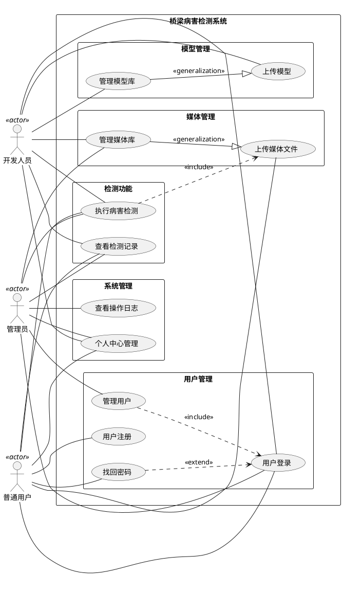

# 3.3.1 桥梁病害检测系统用例图

## 用例说明

### 角色描述

1. **管理员(Admin)**：系统最高权限用户，可以管理所有用户、查看操作日志、管理媒体库和执行病害检测。
2. **开发人员(Developer)**：具有上传和管理模型的特殊权限，同时可以使用系统的病害检测功能。
3. **普通用户(User)**：可以使用基本功能，如上传媒体、执行病害检测和查看自己的检测记录。

### 主要用例

1. **用户登录**：所有用户通过账号密码登录系统。
2. **用户注册**：新用户注册账号。
3. **找回密码**：用户忘记密码时的恢复功能，扩展于用户登录用例。
4. **管理用户**：管理员可以添加、编辑、封禁和注销用户账号，包含用户登录用例。
5. **查看操作日志**：管理员可以查看系统操作日志，监控系统活动。
6. **个人中心管理**：用户可以查看和编辑个人信息。
7. **上传媒体文件**：用户可以上传图片或视频文件。
8. **管理媒体库**：管理和查看已上传的媒体文件，是上传媒体文件的泛化。
9. **上传模型**：开发人员可以上传病害检测模型。
10. **管理模型库**：开发人员可以管理和查看已上传的模型，是上传模型的泛化。
11. **执行病害检测**：用户选择模型和媒体文件执行病害检测，包含上传媒体文件用例。
12. **查看检测记录**：用户可以查看历史检测记录和结果。

### UML关系说明

1. **关联(Association)**：表示参与者与用例之间的交互关系，如管理员与管理用户用例之间的关联。
2. **包含(Include)**：表示一个用例包含另一个用例的功能，如管理用户包含用户登录。
3. **扩展(Extend)**：表示一个用例在特定条件下扩展另一个用例的功能，如找回密码扩展用户登录。
4. **泛化(Generalization)**：表示一个用例是另一个用例的特殊化，如管理媒体库是上传媒体文件的泛化。