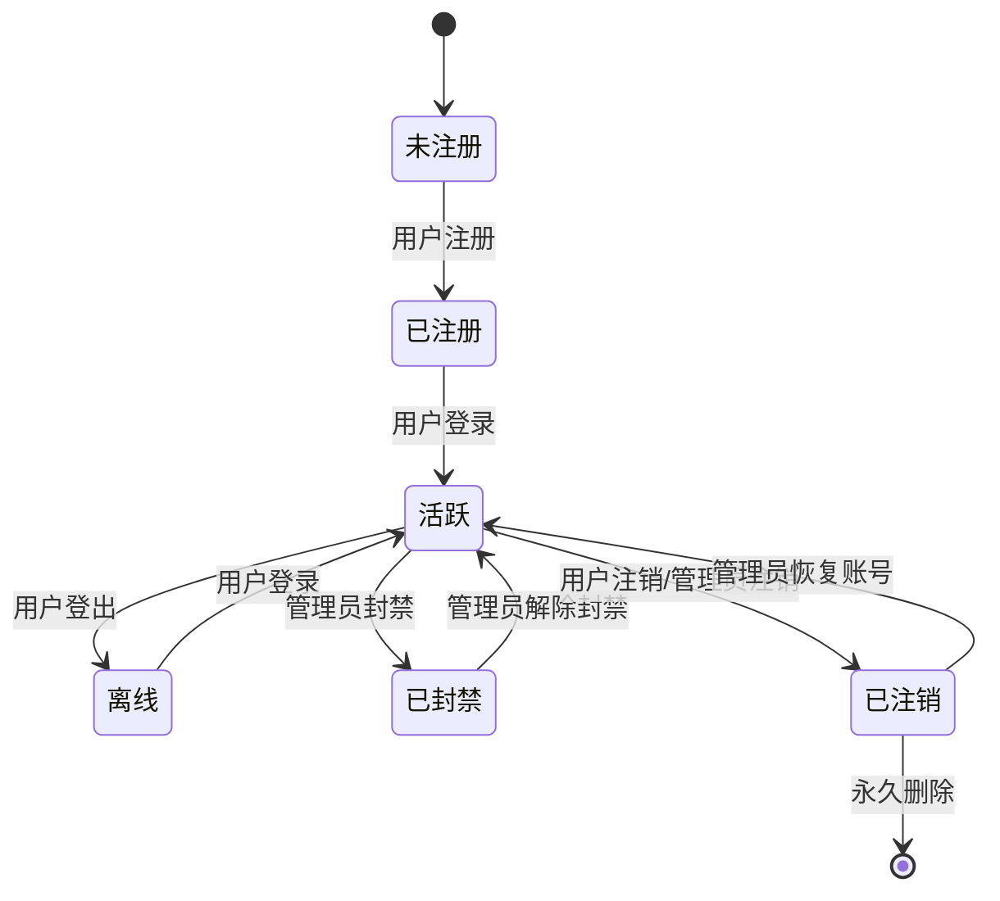
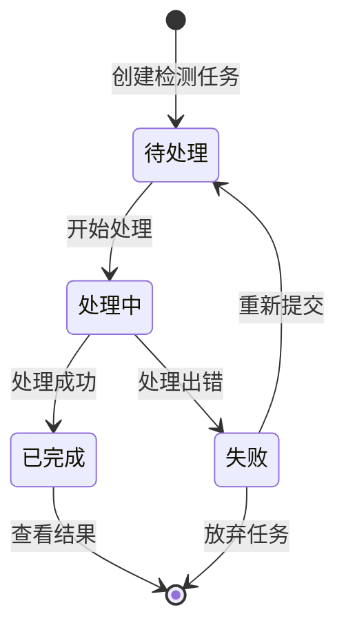
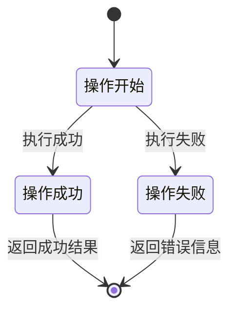

# 3.3.2 桥梁病害检测系统状态图

## 用户账户状态图

## 检测任务状态图

## 操作状态图

## 状态说明

### 用户账户状态

1. **未注册**：用户尚未在系统中注册账号。
2. **已注册**：用户已完成注册但尚未登录。
3. **活跃**：用户当前已登录系统并可以使用功能。
4. **离线**：用户已注册但当前未登录系统。
5. **已封禁**：用户账号被管理员封禁，无法登录系统。
6. **已注销**：用户账号已被注销，但数据仍保留在系统中。

### 检测任务状态

1. **待处理**：检测任务已创建但尚未开始处理。
2. **处理中**：系统正在执行病害检测分析。
3. **已完成**：检测任务成功完成，结果可查看。
4. **失败**：检测任务处理过程中出错。

### 操作状态

1. **操作开始**：系统开始执行用户请求的操作。
2. **操作成功**：操作执行成功，返回预期结果。
3. **操作失败**：操作执行失败，返回错误信息。