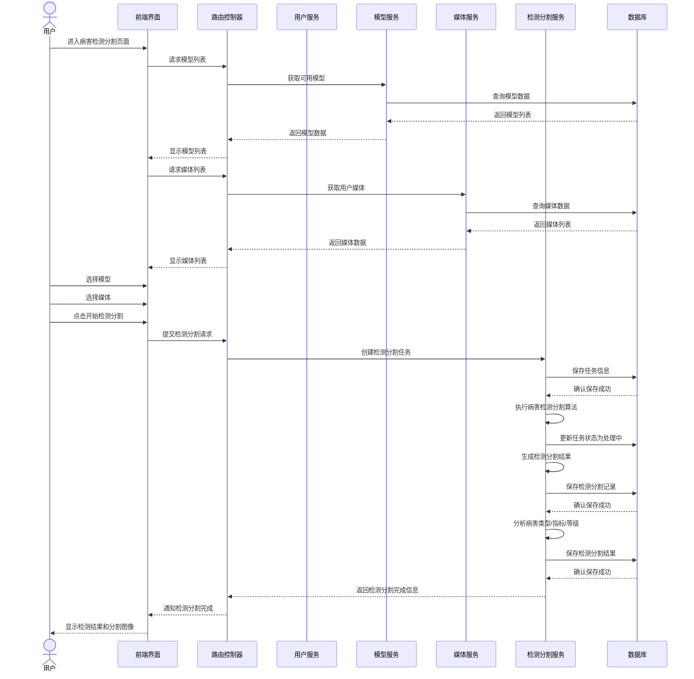
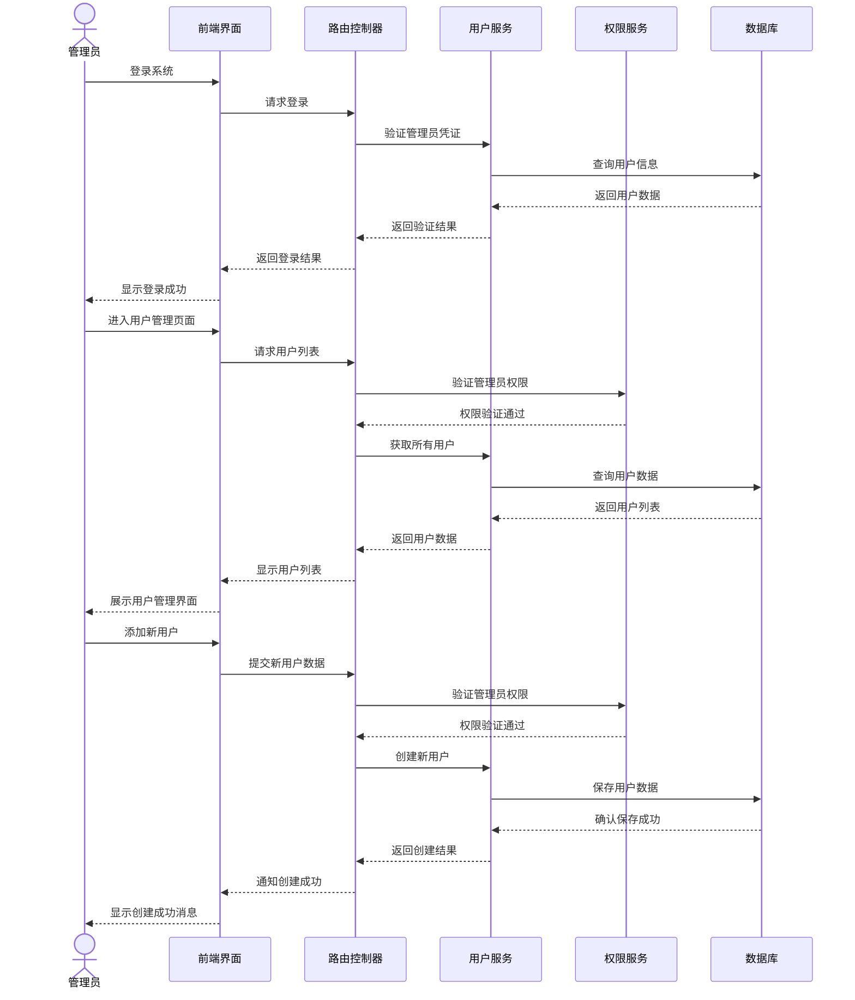
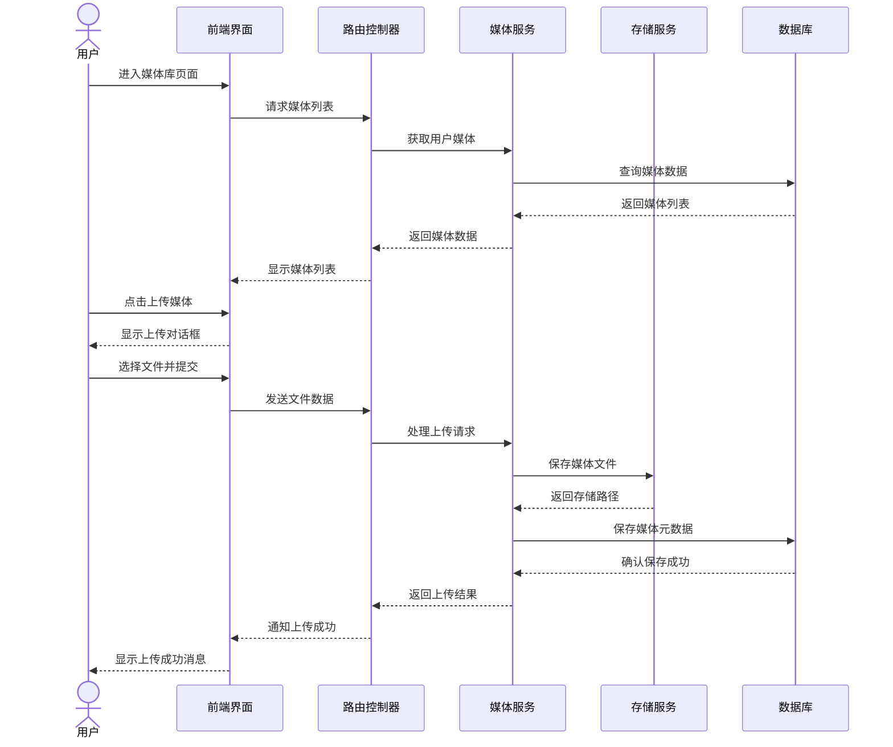
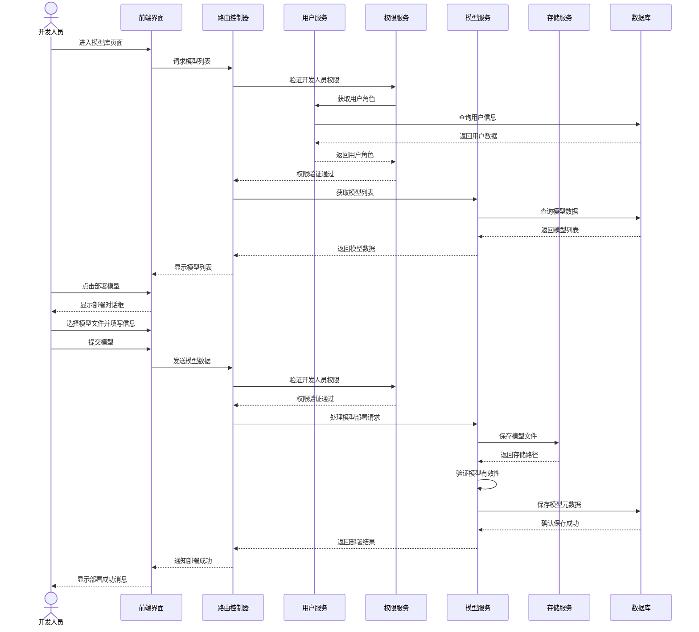

# 3.3.3 桥梁病害检测系统顺序图

## 病害检测分割顺序图

```mermaid
sequenceDiagram
    actor 用户
    participant 前端界面
    participant 路由控制器
    participant 用户服务
    participant 模型服务
    participant 媒体服务
    participant 检测分割服务
    participant 数据库
    
    用户->>前端界面: 进入病害检测分割页面
    前端界面->>路由控制器: 请求模型列表
    路由控制器->>模型服务: 获取可用模型
    模型服务->>数据库: 查询模型数据
    数据库-->>模型服务: 返回模型列表
    模型服务-->>路由控制器: 返回模型数据
    路由控制器-->>前端界面: 显示模型列表
    
    前端界面->>路由控制器: 请求媒体列表
    路由控制器->>媒体服务: 获取用户媒体
    媒体服务->>数据库: 查询媒体数据
    数据库-->>媒体服务: 返回媒体列表
    媒体服务-->>路由控制器: 返回媒体数据
    路由控制器-->>前端界面: 显示媒体列表
    
    用户->>前端界面: 选择模型
    用户->>前端界面: 选择媒体
    用户->>前端界面: 点击开始检测分割
    前端界面->>路由控制器: 提交检测分割请求
    路由控制器->>检测分割服务: 创建检测分割任务
    检测分割服务->>数据库: 保存任务信息
    数据库-->>检测分割服务: 确认保存成功
    
    检测分割服务->>检测分割服务: 执行病害检测分割算法
    检测分割服务->>数据库: 更新任务状态为处理中
    检测分割服务->>检测分割服务: 生成检测分割结果
    检测分割服务->>数据库: 保存检测分割记录
    数据库-->>检测分割服务: 确认保存成功
    检测分割服务->>检测分割服务: 分析病害类型/指标/等级
    检测分割服务->>数据库: 保存检测分割结果
    数据库-->>检测分割服务: 确认保存成功
    检测分割服务-->>路由控制器: 返回检测分割完成信息
    路由控制器-->>前端界面: 通知检测分割完成
    前端界面-->>用户: 显示检测结果和分割图像
```

## 用户管理顺序图

```mermaid
sequenceDiagram
    actor 管理员
    participant 前端界面
    participant 路由控制器
    participant 用户服务
    participant 权限服务
    participant 数据库
    
    管理员->>前端界面: 登录系统
    前端界面->>路由控制器: 请求登录
    路由控制器->>用户服务: 验证管理员凭证
    用户服务->>数据库: 查询用户信息
    数据库-->>用户服务: 返回用户数据
    用户服务-->>路由控制器: 返回验证结果
    路由控制器-->>前端界面: 返回登录结果
    前端界面-->>管理员: 显示登录成功
    
    管理员->>前端界面: 进入用户管理页面
    前端界面->>路由控制器: 请求用户列表
    路由控制器->>权限服务: 验证管理员权限
    权限服务-->>路由控制器: 权限验证通过
    路由控制器->>用户服务: 获取所有用户
    用户服务->>数据库: 查询用户数据
    数据库-->>用户服务: 返回用户列表
    用户服务-->>路由控制器: 返回用户数据
    路由控制器-->>前端界面: 显示用户列表
    前端界面-->>管理员: 展示用户管理界面
    
    管理员->>前端界面: 添加新用户
    前端界面->>路由控制器: 提交新用户数据
    路由控制器->>权限服务: 验证管理员权限
    权限服务-->>路由控制器: 权限验证通过
    路由控制器->>用户服务: 创建新用户
    用户服务->>数据库: 保存用户数据
    数据库-->>用户服务: 确认保存成功
    用户服务-->>路由控制器: 返回创建结果
    路由控制器-->>前端界面: 通知创建成功
    前端界面-->>管理员: 显示创建成功消息
```

## 媒体上传顺序图

```mermaid
sequenceDiagram
    actor 用户
    participant 前端界面
    participant 路由控制器
    participant 媒体服务
    participant 存储服务
    participant 数据库
    
    用户->>前端界面: 进入媒体库页面
    前端界面->>路由控制器: 请求媒体列表
    路由控制器->>媒体服务: 获取用户媒体
    媒体服务->>数据库: 查询媒体数据
    数据库-->>媒体服务: 返回媒体列表
    媒体服务-->>路由控制器: 返回媒体数据
    路由控制器-->>前端界面: 显示媒体列表
    
    用户->>前端界面: 点击上传媒体
    前端界面-->>用户: 显示上传对话框
    用户->>前端界面: 选择文件并提交
    前端界面->>路由控制器: 发送文件数据
    路由控制器->>媒体服务: 处理上传请求
    媒体服务->>存储服务: 保存媒体文件
    存储服务-->>媒体服务: 返回存储路径
    媒体服务->>数据库: 保存媒体元数据
    数据库-->>媒体服务: 确认保存成功
    媒体服务-->>路由控制器: 返回上传结果
    路由控制器-->>前端界面: 通知上传成功
    前端界面-->>用户: 显示上传成功消息
```

## 模型部署顺序图

```mermaid
sequenceDiagram
    actor 开发人员
    participant 前端界面
    participant 路由控制器
    participant 用户服务
    participant 权限服务
    participant 模型服务
    participant 存储服务
    participant 数据库
    
    开发人员->>前端界面: 进入模型库页面
    前端界面->>路由控制器: 请求模型列表
    路由控制器->>权限服务: 验证开发人员权限
    权限服务->>用户服务: 获取用户角色
    用户服务->>数据库: 查询用户信息
    数据库-->>用户服务: 返回用户数据
    用户服务-->>权限服务: 返回用户角色
    权限服务-->>路由控制器: 权限验证通过
    路由控制器->>模型服务: 获取模型列表
    模型服务->>数据库: 查询模型数据
    数据库-->>模型服务: 返回模型列表
    模型服务-->>路由控制器: 返回模型数据
    路由控制器-->>前端界面: 显示模型列表
    
    开发人员->>前端界面: 点击部署模型
    前端界面-->>开发人员: 显示部署对话框
    开发人员->>前端界面: 选择模型文件并填写信息
    开发人员->>前端界面: 提交模型
    前端界面->>路由控制器: 发送模型数据
    路由控制器->>权限服务: 验证开发人员权限
    权限服务-->>路由控制器: 权限验证通过
    路由控制器->>模型服务: 处理模型部署请求
    模型服务->>存储服务: 保存模型文件
    存储服务-->>模型服务: 返回存储路径
    模型服务->>模型服务: 验证模型有效性
    模型服务->>数据库: 保存模型元数据
    数据库-->>模型服务: 确认保存成功
    模型服务-->>路由控制器: 返回部署结果
    路由控制器-->>前端界面: 通知部署成功
    前端界面-->>开发人员: 显示部署成功消息
```