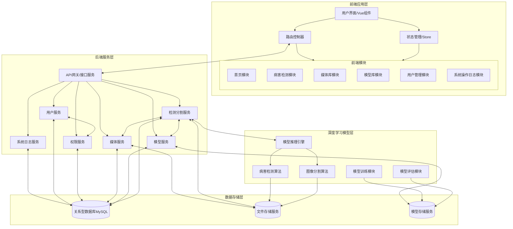
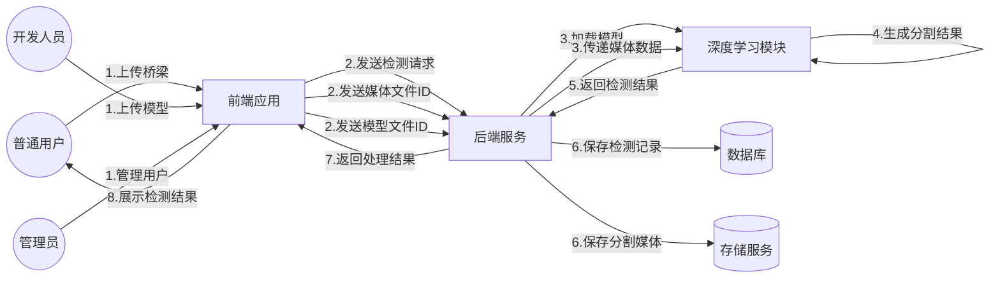
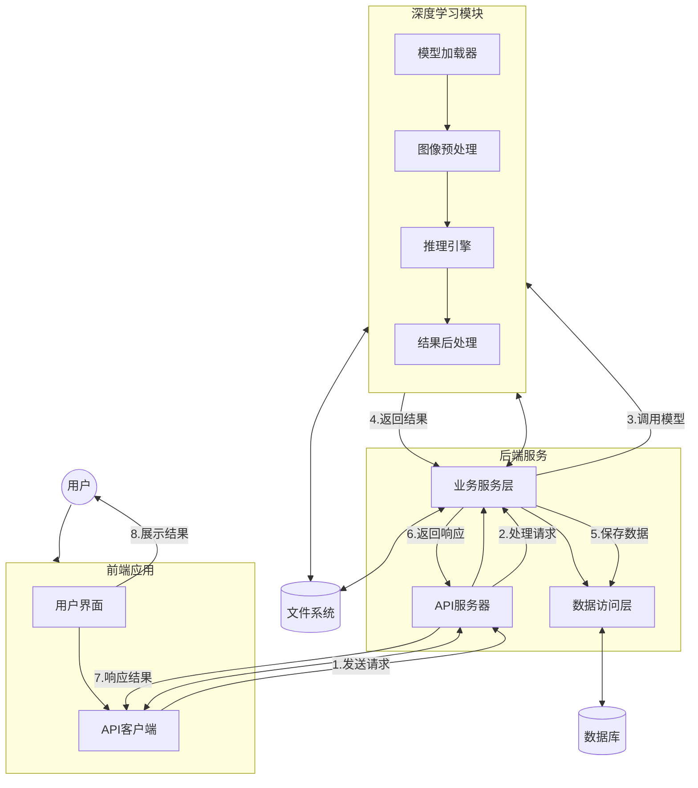

# 3.3.6 桥梁病害检测系统架构图

## 系统整体架构图

```mermaid
flowchart TB
    %% 定义主要组件
    subgraph 前端层[前端应用层]
        UI[用户界面/Vue组件] --> Router[路由控制器]
        UI --> Store[状态管理/Store]
        
        subgraph 前端模块
            direction TB
            HomeView[首页模块]
            DetectionView[病害检测模块]
            MediaView[媒体库模块]
            ModelView[模型库模块]
            UserView[用户管理模块]
            OperationView[系统操作日志模块]
        end
        
        Router --> 前端模块
        Store --> 前端模块
    end
    
    subgraph 后端层[后端服务层]
        API[API网关/接口服务] --> UserService[用户服务]
        API --> LogService[系统日志服务]
        API --> MediaService[媒体服务]
        API --> ModelService[模型服务]
        API --> DetectionService[检测分割服务]
        API --> AuthService[权限服务]
        
        %% 服务间交互
        UserService <--> AuthService
        DetectionService <--> ModelService
        DetectionService <--> MediaService
    end
    
    subgraph 深度学习层[深度学习模型层]
        ModelInference[模型推理引擎]
        DiseaseDetection[病害检测算法]
        ImageSegmentation[图像分割算法]
        ModelTraining[模型训练模块]
        ModelEvaluation[模型评估模块]
        
        ModelInference --> DiseaseDetection
        ModelInference --> ImageSegmentation
    end
    
    subgraph 数据层[数据存储层]
        Database[(关系型数据库MySQL)]
        FileStorage[(文件存储服务)]
        ModelStorage[(模型存储服务)]
    end
    
    %% 定义层间交互关系
    Router <--> API
    
    %% 系统服务交互
    LogService <--> Database
    
    %% 用户服务交互
    UserService <--> Database
    AuthService <--> Database
    
    %% 媒体服务交互
    MediaService <--> FileStorage
    MediaService <--> Database
    
    %% 模型服务交互
    ModelService <--> ModelStorage
    ModelService <--> Database
    
    %% 检测服务交互
    DetectionService <--> ModelInference
    DetectionService <--> Database
    DetectionService <--> FileStorage
    
    %% 深度学习模块交互
    ModelTraining --> ModelStorage
    ModelEvaluation --> ModelStorage
    DiseaseDetection --> FileStorage
    ImageSegmentation --> FileStorage
```

## 系统数据流图

```mermaid
flowchart LR
    %% 定义主要角色和组件
    User((普通用户)) --> |1.上传桥梁| Frontend[前端应用]
    Developer((开发人员)) --> |1.上传模型| Frontend
    Admin((管理员)) --> |1.管理用户| Frontend
    
    %% 前端到后端的数据流
    Frontend --> |2.发送检测请求| Backend[后端服务]
    Frontend --> |2.发送媒体文件ID| Backend
    Frontend --> |2.发送模型文件ID| Backend
    
    %% 后端到深度学习模块的数据流
    Backend --> |3.加载模型| DL[深度学习模块]
    Backend --> |3.传递媒体数据| DL
    
    %% 深度学习模块处理
    DL --> |4.执行病害检测| DL
    DL --> |4.生成分割结果| DL
    
    %% 结果返回流程
    DL --> |5.返回检测结果| Backend
    Backend --> |6.保存检测记录| DB[(数据库)]
    Backend --> |6.保存分割媒体| Storage[(存储服务)]
    Backend --> |7.返回处理结果| Frontend
    Frontend --> |8.展示检测结果| User
```

## 系统组件交互图

```mermaid
flowchart TB
    %% 定义用户交互入口
    User((用户)) --> Frontend[前端应用]
    
    %% 前端组件
    subgraph Frontend[前端应用]
        direction TB
        UI[用户界面] --> API_Client[API客户端]
    end
    
    %% 后端服务
    subgraph Backend[后端服务]
        direction TB
        API_Server[API服务器] --> Services[业务服务层]
        Services --> ORM[数据访问层]
    end
    
    %% 深度学习模块
    subgraph DL_Module[深度学习模块]
        direction TB
        ModelLoader[模型加载器] --> Preprocessor[图像预处理]
        Preprocessor --> Inference[推理引擎]
        Inference --> Postprocessor[结果后处理]
    end
    
    %% 数据存储
    Database[(数据库)]
    FileSystem[(文件系统)]
    
    %% 组件间交互
    API_Client <--> API_Server
    Services <--> DL_Module
    ORM <--> Database
    Services <--> FileSystem
    DL_Module <--> FileSystem
    
    %% 关键流程标注
    API_Client -- "1.发送请求" --> API_Server
    API_Server -- "2.处理请求" --> Services
    Services -- "3.调用模型" --> DL_Module
    DL_Module -- "4.返回结果" --> Services
    Services -- "5.保存数据" --> ORM
    Services -- "6.返回响应" --> API_Server
    API_Server -- "7.响应结果" --> API_Client
    UI -- "8.展示结果" --> User
```